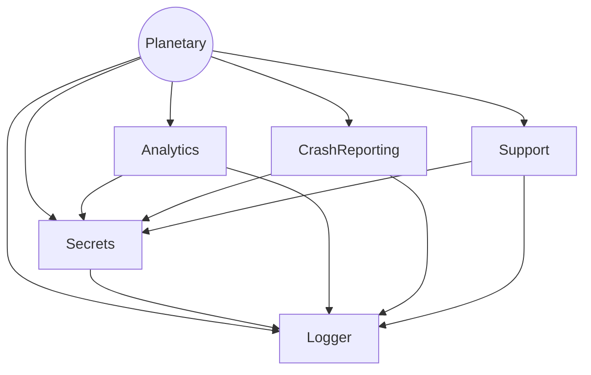

# Contributing

Planetary is an open-source project, as such, we openly welcome contributions of any sort: code improvement, bug fixes, translations, new features, bug reports...

We encourage you to read this guide first or contact any of us.

## Bug Reports

Feel free to open an [issue on Github](https://github.com/planetary-social/planetary-ios/issues), be sure to include a good description of the bug you found.

## Translations

If you want to contribute by translating the app to another language, you can head in to our [project in Crowdin](https://crowdin.com/project/planetary) and start translating there. It will automatically generate a Pull Request that we will happily take care of merging.

## Building

Planetary iOS is built using Xcode. To build it yourself you can follow the steps below. These steps assume you have installed Xcode, Homebrew, and have some familiarity with the Terminal app. You can see what version of Xcode our team is using in the .xcode-version file in this repository.

From the Terminal: 

1. `brew install git-lfs swiftlint`

2. `git clone git@github.com:planetary-social/planetary-ios.git`

3. `cd planetary-ios`

4. Prevent git from commiting your API keys (see below, The Secrets.plist configuration file) in the public repository

```sh
git update-index --skip-worktree Resources/Secrets.debug.plist
```

5. Open the Planetary project in Xcode:

```sh
open Planetary.xcworkspace
```

In Xcode:

6. In the menu bar choose Product -> Build

## Running

The app is fully functional in the iOS simulator. To run the app in the simulator, select a simulator using the Product -> Destination menu in Xcode, and then click Product -> Run.  If you want to run it on a device you will need to change the Bundle Identifier and Code Signing settings to use your personal team.

## Contributing Code

If you'd like to contribute code to the main branch of Planetary, it's best to check with us first. The best way to do this is to open or comment on an [issue](https://github.com/planetary-social/planetary-ios/issues) describing your proposed change. Feel free to @-mention some of the maintainers if we don't respond in a reasonable amount of time.

### Opening a Pull Request

For now `main` is the main branch and code improvements are made in topic branches that get merged into it.

1. Fork the repo and create a branch named `initials-topic` or ticket tag like `esw-190`.
2. Make your proposed changes. Make sure to test them thoroughly and consider adding unit or integration tests.
3. Open a PR with a short description of what the PR accomplishes, and a link to the corresponding issue.
4. If possible add screenshots (use shift-command-4-space-click to capture the iOS simulator window).

A maintainer will review your code and merge it when it has the required number of approvals.

### Merging a Pull Request

1. Select "Squash and merge" from the drop-down Merge button.
2. Delete the branch (as the UI recommends) to keep the repo clean.

### Architecture

**A good place to start: all of our important architectural decisions are being annotated inside the [Architecture folder](Architecture/) using [Architecture Decision Records](http://thinkrelevance.com/blog/2011/11/15/documenting-architecture-decisions).**

Planetary is organized around [major components](https://developer.apple.com/documentation/swift_packages/organizing_your_code_with_local_packages). A quick look to the dependency graph:



You can contribute by working on each of these packages, or in the Planetary app itself.

### Dependency Management

We install some of our depencies using CocoaPods. If you are adding a new dependency we prefer to use the Swift Package Manager. If you need to change an exising dependency, install the `cocoapods` dependency manager first. 

#### Cocoapods

1. Install `rbenv` using [Homebrew](https://brew.sh/) and add it to your shell: 

```
$ brew install rbenv && rbenv init
```

2. Install ruby v2.7.5

```
$ rbenv install 2.7.5
```

3. Install gem

```
$ gem install cocoapods
```

4. Install dependencies

```
$ pod install
```

#### Creating a Swift Package

In order to create a new package, follow these steps:

1. In Xcode, select File > New > Package...
2. Give it a name and be sure to select the Planetary workspace under `Add to` and `Group`
3. Add the package in `Framework, Libraries, and Embedded Content` under the `Planetary` target (in the `General` tab) and under `Link Binary with Libraries` under the `UnitTests` target (in the `Build phases` tab)
4. Be sure to make tests _execute in parallel_ and _in random order_ by turning on both options in Edit scheme > Test > Info
5. Be sure to enable _code coverage_ when running tests by turning on that option in Edit scheme > Test > Options
6. Add a new job in `.github/workflows/main.yml` just like the other packages

You are ready to go. Please, use other local swift packages like `Analytics` or `Logger` as a model to develop the new package and **write tests**, we are aiming to a code coverage of more than 90% in our packages.

### The Secrets.plist configuration file

In order to configure third-party libraries, we need to add API keys. They are listed in the [Secrets.debug.plist](Resources/Secrets.debug.plist) file with empty values, the app still works without them. When making a Release build, you will need a similar file named Secrets.release.plist added in the same folder.

### Go Development

Planetary’s underlying SSB protocol implementation is written in Go (see [cryptoscope/ssb](https://github.com/cryptoscope/ssb)). The GoSSB folder contains an Xcode project that packages [cryptoscope/ssb](https://github.com/cryptoscope/ssb) as an XCFramework that works across Apple’s various platforms and architectures. GoSSB.xcframework is included in this repository so that contributors don’t need to install a full Go stack to work on the iOS app. More information about the GoSSB.xcframework can be found in its [README](GoSSB/README.md)
